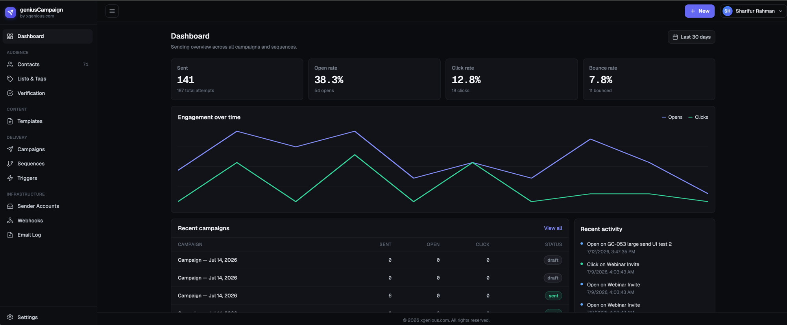
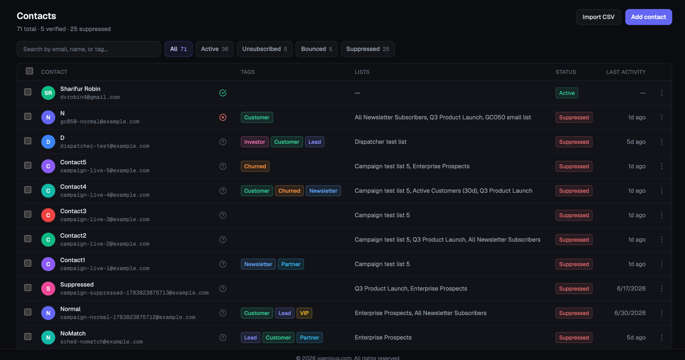
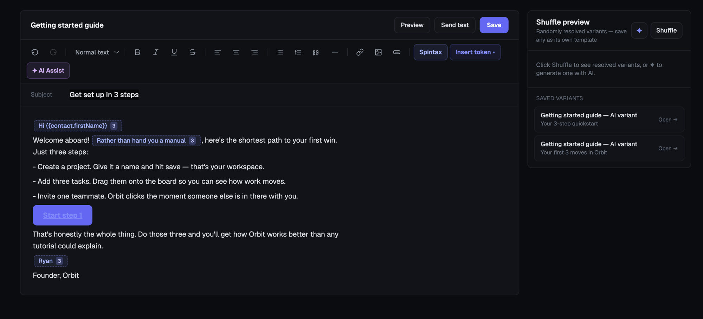
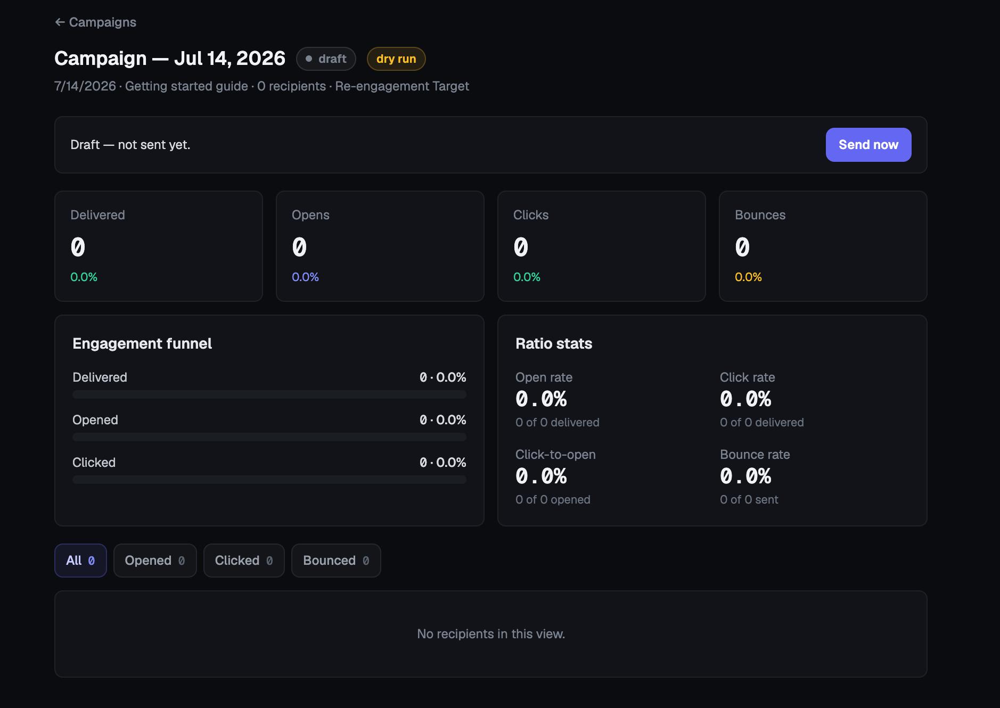

# geniusCampaign

Free, open-source, self-hosted email marketing and outreach platform. Contacts, templates, sequences, campaigns, deliverability, and sender rotation in one console — built and maintained by [xgenious.com](https://xgenious.com).

Bring your own AWS SES / Gmail Workspace / Cloudflare R2 / verification-provider credentials. Nothing routes through a third-party server.

## Features

- **Contacts, lists & tags** — CSV import with arbitrary column mapping, real-time import progress, and pick-or-create lists/tags at import time
- **Template editor** — rich-text editor with spintax variants and AI-assisted copywriting (OpenAI or DeepSeek)
- **Sequences** — multi-step drip sequences with per-contact enrollment, pause/resume, and per-step delays
- **Campaigns** — one-off sends targeted by list, by tag, or by hand-picked contacts, with open/click tracking and engagement analytics
- **Email verification** — bulk deliverability checks (Reoon primary, NeverBounce fallback) before you send
- **Triggers & webhooks** — auto-enroll contacts on events (tag added, field changed, list joined, or an inbound HMAC-signed webhook)
- **Public API** — API-key-authenticated endpoint for external forms/automation tools to push contacts in, with automatic list/tag attachment (see [docs/PUBLIC_API.md](docs/PUBLIC_API.md))
- **Sender rotation** — AWS SES and Gmail Workspace accounts, quota-aware, rotated automatically
- **Team & audit** — role-based access (owner/editor/viewer), a full audit log, and a global suppression list checked before every send

## Screenshots

| | |
|---|---|
|  Dashboard |  Contacts |
|  Template editor (spintax + AI assist) |  Campaign detail |
|  Sequence builder |  Webhooks |

## Tech stack

- **Backend**: NestJS (TypeScript), PostgreSQL via Drizzle ORM, BullMQ + Redis for all queued/scheduled work
- **Frontend**: React (Vite) + TypeScript, Tailwind CSS, Zustand
- **Monorepo**: npm workspaces (`apps/api`, `apps/web`, `packages/shared`)

## Quick start (local development)

Prerequisites: Node.js 22+, PostgreSQL, Redis, all running locally.

```bash
git clone https://github.com/XgeniousLLC/geniousCampaign.git
cd geniousCampaign
npm install

createdb geniuscampaign_dev
cp .env.example .env
# Edit .env — at minimum set JWT_SECRET (openssl rand -hex 32).
# Everything else can stay blank until you need that specific feature.

npm run db:migrate --workspace apps/api
npm run dev
```

This starts both the API (`http://localhost:3000`) and the web app (`http://localhost:5173`) with hot reload. See `.env.example` for the full list of optional integration credentials (AWS SES, Cloudflare R2, Gmail OAuth, Reoon/NeverBounce, OpenAI/DeepSeek, Slack) — most of these can also be set later from the running app's Settings > Integrations page instead of editing `.env` directly. Two exceptions: the open/click tracking domain is DB-only and requires a live DNS check (Settings > Integrations > "Open/click tracking" — type a domain, "Check DNS" shows the CNAME record to add, saves only once it resolves), and the Gmail OAuth app is configured from the Sender Accounts page itself (lock icon next to "Connect Gmail account"), not Settings > Integrations.

## Running with Docker

Prefer containers? See **[DEPLOY.md](./DEPLOY.md)** — covers both `docker compose up` (recommended for self-hosting) and a manual/bare-metal deployment path, plus the full environment variable reference for production.

## Project structure

```
geniusCampaign/
  apps/
    api/          NestJS backend
    web/          React admin app
  packages/
    shared/       Shared TS types (DTOs, enums) used by both api and web
  docs/           Sprint plan, ticket history, design reference
  CLAUDE.md       Architecture decisions and conventions
  DEPLOY.md       Deployment guide (Docker + manual)
```

## Public API

Push contacts in from an external form or automation tool (Zapier, a custom script, a website contact form) — see **[docs/PUBLIC_API.md](docs/PUBLIC_API.md)** for authentication, the full endpoint reference, and request/response examples. Keys are created and managed from Settings > API keys in the app.

## Contributing / architecture notes

`CLAUDE.md` documents the load-bearing architectural decisions (per-contact sequence enrollment, the shared event bus, spintax resolution order, sender-provider abstraction, etc.) — read it before making structural changes.

## License

MIT — see [LICENSE](./LICENSE).
