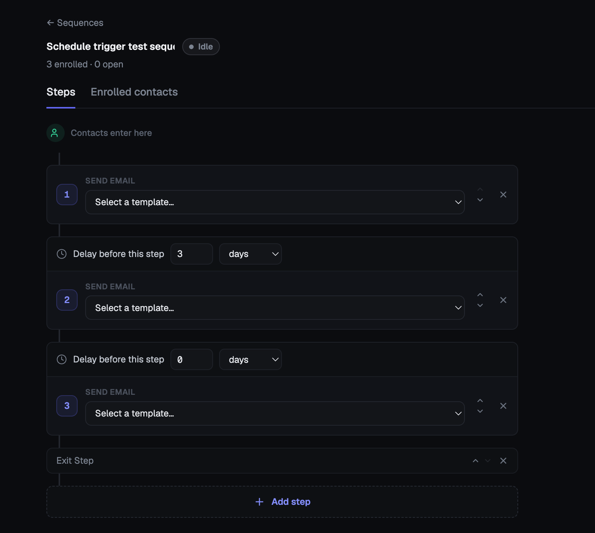

## Sequences

What this page is for: building a multi-step automated email drip (e.g. Day 0 intro, wait 3 days, Day 3 follow-up) and enrolling contacts into it.

**Where to find it:** sidebar > **Sequences** (`/sequences`) for the list; clicking a sequence (or **New sequence**) opens the builder (`/sequences/:id`).

### The most important concept: a sequence is a template, not a clock

A sequence itself is just a reusable definition — its steps and the delays between them. It does not have a "start date." What actually runs is a **per-contact enrollment**: the moment you enroll a contact, a fresh enrollment row is created for that (sequence, contact) pair with its own current step and its own "next send" time, starting at step 1. Two contacts enrolled a month apart each get their own independent clock counted from *their own* enrollment moment — enrolling someone today never makes them "catch up" to where an earlier-enrolled contact currently is, and nothing about a sequence's own history affects a newly-enrolled contact's schedule.

### Building the steps

1. Open a sequence and go to the **Steps** tab (the default). Click **Add step** to append a new "Send email" step.
2. For each step, pick which **template** to send from the dropdown. If that template has saved shuffle/AI variants, they appear as small pills underneath so you can quickly A/B swap which variant this step sends — click **+ Manage variants** to jump into the template editor and create more.
3. Set the **delay before this step** (in minutes/hours/days) — this is the wait time after the *previous* step before this one fires. The first step has no delay (contacts enter immediately).
4. Reorder steps with the up/down arrows, or remove a step with the ✕.
5. The **Summary** panel on the right totals the number of steps and the sequence's total elapsed duration end-to-end.
6. Rename the sequence by editing the name field at the top — it saves automatically when you click away.

### Enrolling contacts

- From the sequence itself: click **Enroll contacts**, pick a contact not already actively/paused in this sequence, and click **Enroll**.
- From the Contacts list: select one or more contacts, use the **Enroll** bulk action, and pick a sequence.
- From a contact's own profile page (**Sequence enrollments** panel): pick a sequence from the dropdown and click **Enroll**.
- Bulk-importing via CSV does not enroll contacts automatically — enrollment is always a separate, explicit step.

### Pausing, resuming, and stopping an enrollment

You can act on an individual enrollment from either the sequence's **Enrolled contacts** tab or the contact's own profile page:

- **Pause** — the enrollment stops advancing; its next scheduled step won't fire while paused. Pausing takes effect immediately, even if a step was already queued to run — the system re-checks the enrollment's live status right before actually sending, so a pause is never "too late."
- **Resume** — picks back up from wherever it left off (same current step, same remaining delay logic).
- **Stop** — permanently ends this contact's enrollment; it can't be resumed afterward (you'd re-enroll them from scratch, which restarts at step 1).
- **Pause sequence** (top of the builder) pauses every currently-active enrollment in that sequence at once — it's a bulk convenience, not a sequence-level switch; each enrollment is still paused individually under the hood.

### Reading the Enrolled contacts tab

Shows every contact ever enrolled, their current step, and status (**active**, **paused**, **stopped**, or **completed**) — plus Pause/Resume/Stop actions for anyone still active or paused.

### Things to know

- Because enrollment is per-contact, re-enrolling someone who previously completed or was stopped starts them over from step 1 — there's no "resume where you left off before" for a finished/stopped enrollment.
- A contact can be enrolled in more than one sequence at the same time, but only once (active/paused) per sequence at a time — the enroll pickers exclude anyone already actively/paused-enrolled in that sequence.
- Editing a step's template or delay after contacts are already enrolled affects everyone still on that step going forward — it doesn't retroactively change what was already sent.
