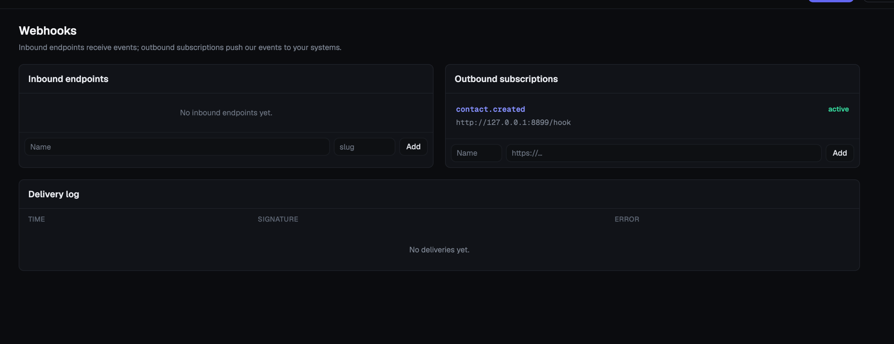

## Webhooks

What this page is for: managing two independent, opposite-direction integrations — **inbound endpoints** that let external systems push events into Genius Campaign (e.g. to fire a trigger), and **outbound subscriptions** that push Genius Campaign's own events out to your other tools.

**Where to find it:** sidebar > **Webhooks** (`/webhooks`).

This page is *not* where you manage the separate public API used for simple "push a contact in" integrations (website forms, Zapier) — that lives in **Settings > API keys**, uses a different auth model, and is covered in `api-and-integrations.md`. The distinction matters:

| | Inbound webhook endpoint (this page) | Public API (Settings > API keys) |
|---|---|---|
| Auth | `X-Signature` header, HMAC-SHA256 against a per-endpoint secret | `X-Api-Key` header, a static bearer key |
| Shape | Arbitrary payload, field-mapped, can fire triggers | Fixed "create/update a contact" shape |
| Best for | Systems that can compute a signature | Simple tools that can only send a static header |

### Creating an inbound endpoint

1. Under **Inbound endpoints**, enter a **Name** and a URL-safe **slug**, then click **Add**.
2. This creates a unique URL at `POST /webhooks/in/<slug>` and generates a secret (shown truncated on this page — the sending system needs the full secret to compute its signature; get it from wherever your deployment surfaces secrets, as this page only displays the first several characters for identification).
3. Whoever configures the sending system must sign every request body with HMAC-SHA256 using that secret and send the result in an `X-Signature` header. A request with a missing or invalid signature is rejected outright and never processed.
4. Every inbound call — valid or not — is logged to the **Delivery log** at the bottom of the page (time, whether the signature was valid, and any processing error), before the payload is acted on, so a bad delivery is always visible and replayable for debugging.
5. Point a **Trigger** at this endpoint (Triggers page, "Webhook-based" type) to have a matching payload automatically enroll a contact into a sequence — see `triggers.md`.

### Creating an outbound subscription

1. Under **Outbound subscriptions**, enter a **Name** and the destination **URL**, then click **Add**.
2. Genius Campaign will POST its own event payloads (e.g. `contact.created`) to that URL whenever a matching internal event fires — this is the direction for pushing your data *out* to another system, the mirror image of the inbound endpoints above.
3. Each subscription shows its subscribed event type(s) and an active/inactive status.

### Reading the delivery log

The delivery log table shows the most recently created endpoint's inbound deliveries: timestamp, whether the signature validated, and any error. This is your primary tool for debugging "why didn't my webhook do anything" — check here first before assuming the trigger or field mapping is at fault.

### Things to know

- An inbound request with a bad or missing signature is rejected before any processing happens — it is still logged to the delivery log (marked invalid) so you can see the attempt, but nothing downstream (trigger evaluation, contact updates) ever runs for it.
- Never put a secret token in the URL itself for an inbound integration — the HMAC signature is the whole point of this framework's security model; a bare-token URL is what the separate API-key-based public API pattern is for instead.
- Outbound subscriptions are signed with a separate shared HMAC secret (`OUTBOUND_WEBHOOK_HMAC_SECRET`, configured in Settings > Integrations) so your receiving system can verify a payload really came from Genius Campaign.
